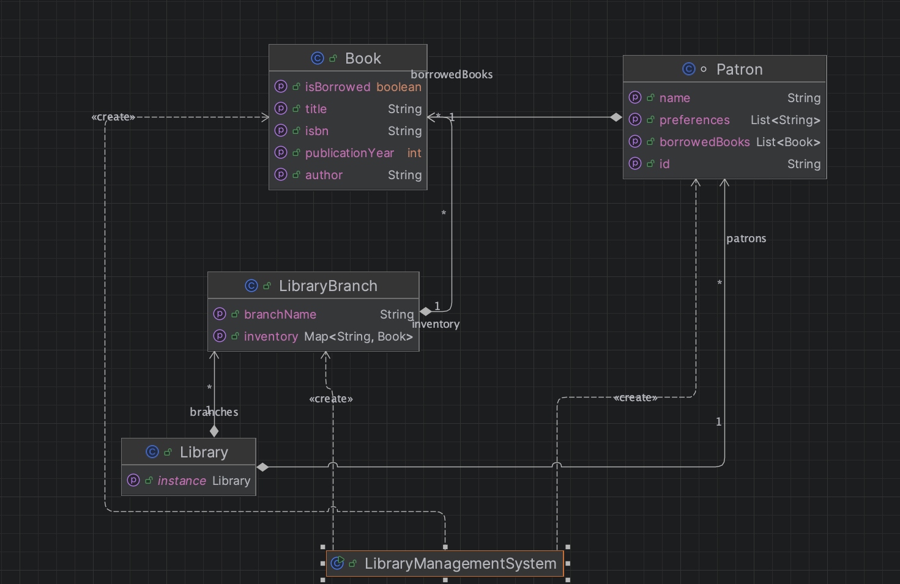

# Library Management System

A Java-based Library Management System designed to manage books, patrons, and lending processes efficiently. The system demonstrates Object-Oriented Programming (OOP) principles, SOLID design, and advanced features such as multi-branch support, reservations, and recommendations.

---

## Features

### Core Functionality
- **Book Management**: Add, remove, update, and search books by title, author, or ISBN.
- **Patron Management**: Manage patron information and borrowing history.
- **Lending Process**: Support book checkout and returns.
- **Inventory Management**: Track available and borrowed books.

### Advanced Features
- **Multi-branch Support**:
  - Manage multiple library branches.
  - Transfer books between branches.
- **Reservation System**:
  - Allow patrons to reserve books.
  - Notify patrons when reserved books become available.
- **Recommendation System**:
  - Recommend books based on borrowing history and preferences.

### Class Diagram



## How to Run
1. Clone the repository:
   ```bash
   git clone <repository-url>
